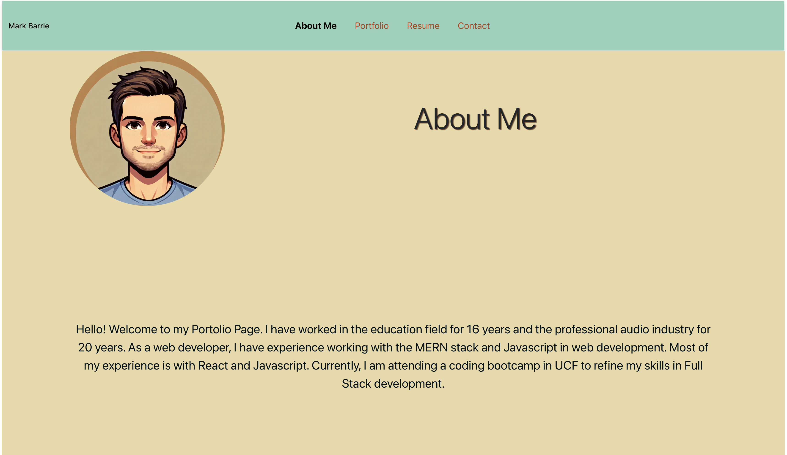
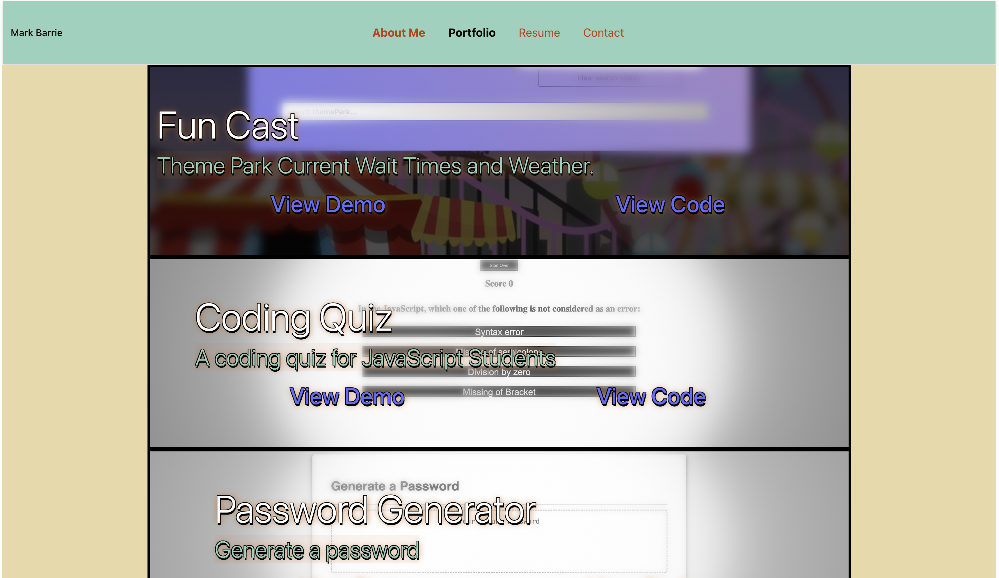
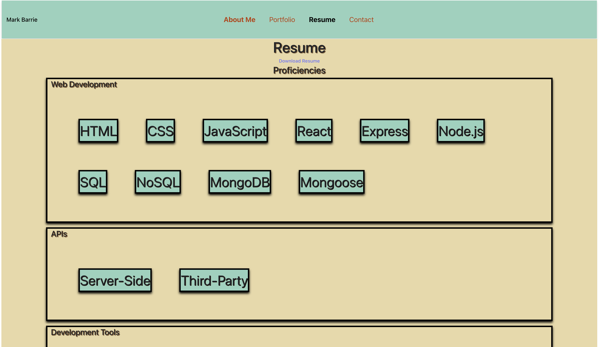
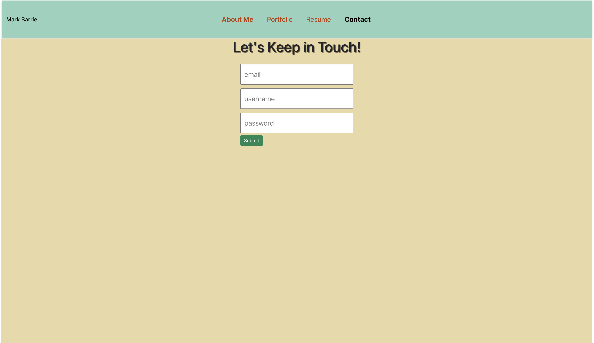

# React-Portfolio-Site

## Table of Contents
1. [Description](#description)
2. [User Story](#user-story)
3. [Acceptance Criteria](#acceptance-criteria)
4. [Installation](#installation)
5. [Usage](#usage)
6. [Screenshots](#screenshots)
7. [Deployment](#deployment)
8. [Built With](#built-with)
9. [Contributing](#contributing)
10. [Contact](#contact)

## Description

The site was create to showcase my developement skills in REACT.  It utilizes Vite, React Router, NavLink and general functionality of React. 

## User Story

    AS AN employer looking for candidates with experience building single-page applications
    I WANT to view a potential employee's deployed React portfolio of work samples
    SO THAT I can assess whether they're a good candidate for an open position

## Acceptance Criteria

    GIVEN a single-page application portfolio for a web developer
    WHEN I load the portfolio
    THEN I am presented with a page containing a header, a section for content, and a footer
    WHEN I view the header
    THEN I am presented with the developer's name and navigation with titles corresponding to different sections of the portfolio
    WHEN I view the navigation titles
    THEN I am presented with the titles About Me, Portfolio, Contact, and Resume, and the title corresponding to the current section is highlighted
    WHEN I click on a navigation title
    THEN the browser URL changes and I am presented with the corresponding section below the navigation and that title is highlighted
    WHEN I load the portfolio the first time
    THEN the About Me title and section are selected by default
    WHEN I am presented with the About Me section
    THEN I see a recent photo or avatar of the developer and a short bio about them
    WHEN I am presented with the Portfolio section
    THEN I see titled images of six of the developer’s applications with links to both the deployed applications and the corresponding GitHub repositories
    WHEN I am presented with the Contact section
    THEN I see a contact form with fields for a name, an email address, and a message
    WHEN I move my cursor out of one of the form fields without entering text
    THEN I receive a notification that this field is required
    WHEN I enter text into the email address field
    THEN I receive a notification if I have entered an invalid email address
    WHEN I am presented with the Resume section
    THEN I see a link to a downloadable resume and a list of the developer’s proficiencies
    WHEN I view the footer
    THEN I am presented with text or icon links to the developer’s GitHub and LinkedIn profiles, and their profile on a third platform (Stack Overflow, Twitter)

## Installation

To get a local copy up and running, follow these simple steps:

git clone:
  
        https://github.com/mbarrie1979/React-Portfolio-Site.git

npm install

npm run dev

## Usage

    Navigate to the prompted URL provided by the development server.
    Explore the different sections: About Me, Portfolio, Contact, and Resume.
    Interact with the contact form to see validation in action.

## Screenshots

### About Me Section

### Portfolio Section

### Contact Section

### Resume Section

## Deployment

This application is deployed on Netlify. You can view the live site [here](https://deploy-preview-17--roaring-brioche-01aedd.netlify.app/).

## Built With

* [React](https://reactjs.org/)
* [Vite](https://vitejs.dev/)
* [Netlify](https://www.netlify.com/)

## Contributing

Contributions are what make the open-source community such an amazing place to learn, inspire, and create. Any contributions you make are greatly appreciated.

    Fork the Project
    Create your Feature Branch (git checkout -b feature/AmazingFeature)
    Commit your Changes (git commit -m 'Add some AmazingFeature')
    Push to the Branch (git push origin feature/AmazingFeature)
    Open a Pull Request

## Contact

Mark Barrie - @mbarriemusic - mark.a.barrie@gmail.com

Project Link: https://github.com/mbarrie1979/React-Portfolio-Site